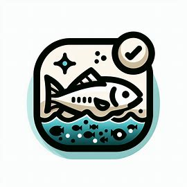
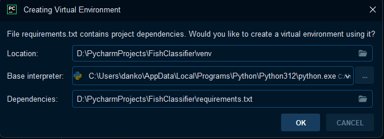

<p align="center" width="100%">
    
</p>

<h2 align="center" width="100%">FishClassifier v 1.0a </h2>

Пет проект, который направлен на взаимодействие с нейронными сетями посредством приложения. 
Здесь заготовлены пару готовых моделей, которые распознают класс рыбы по фото. 

В будущем планируется добавить в поддержку различные нейросети. 

Данные для обучения взяты были отсюда: https://www.kaggle.com/datasets/crowww/a-large-scale-fish-dataset/data

Основа приложения была взята отсюда: https://github.com/Wanderson-Magalhaes/PyBlackBox_Qt_Widgets_PySide6_Or_PyQt6_v1.0.0

--- 

### Установка 

Минимальная версия протестированного Python - **3.12**

1. Если у Вас Pycharm, то при клонировании репозитория может автоматически установить зависимости, создать виртуальное окружение. 
Пример представлен ниже на фото: 



2. При использовании VsCode и т.п Вам придется создавать вручную виртуальное окружение, ставить зависимости. 

Создание виртуального окружения (папка venv)

```bash
python -m venv venv
```

Активация виртуального окружения

- для Windows
```bash
venv\Scripts\activate.bat
```

- для Linux и MacOS
```bash
source venv/bin/activate
``` 

Проверить успешность активации можно по приглашению оболочки. Она будет выглядеть так:
```bash
(venv) root@purplegate:/var/test#
```

---

### Работа с Jupyter из-под Pycharm

Если вы захотите поработать с готовыми ноутбуками, то может быть проблема с виртуальным окружением. 

1. Создание виртуального окружения

```bash
python -m ipykernel install --user --name=myenv
```

2. Запуск 

```bash
jupyter notebook
```

3. Дальше у Вас могут появиться ссылки localhost или само автоматически откроется в браузере.
Дальше вы выбираете вручную ```.ipynb``` файл и выбираете виртуальное окружения для запуска. 

Видео по запуску: https://youtu.be/yr1M1H-GLR0?si=w7C_qkuOa1vV5Y1T

### Улучшения проекта

- Добавить в поддержку сторонние нейросети
- Добавить различные тесты
- Увеличить производительность
- Рефакторить код
- Добавить автоматическое тестирование на GitHub

### Contributors 

- https://github.com/morrs1